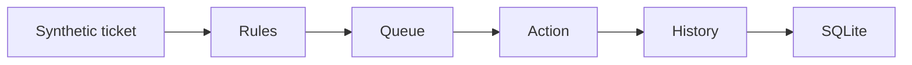

# Python Support Automation Simulator

[](https://github.com/guilherme-lacerda-tech/python-support-automation-simulator/actions/workflows/ci.yml)

[](https://github.com/guilherme-lacerda-tech/python-support-automation-simulator/releases)
[](LICENSE)

Local support workflow simulator with synthetic tickets, rule-based queue assignment and an SQLAlchemy audit trail.

## Why / Problem

Support automation should be explainable: which rule matched, where the ticket went and what state changed. This project demonstrates that workflow without using real tickets or company-specific rules.

## Features

- `Ticket`, `Rule`, `QueueItem`, `Action` and `History` entities.
- Rule-based queue routing.
- Manual-review fallback.
- State-transition audit history.
- SQLite persistence through SQLAlchemy.
- CI with Ruff, PyTest and coverage.

## Architecture



## Tech Stack

Current: `Python` `SQLAlchemy` `SQLite` `JSON` `PyTest` `Ruff`

Planned: queue reports, more transition examples and broader tests after the PyTest study phase.

## Quick Start

```powershell
python -m pip install -e ".[dev]"
python examples/run_demo.py
```

## Tests

```powershell
python -m pytest --cov --cov-report=term-missing
python -m ruff check .
```

## Example Output

```json
{
  "tickets": 3,
  "queues": {
    "data": 1,
    "operations": 1,
    "support": 1
  },
  "history_entries": 3
}
```

## Project Structure

- `src/python_support_automation_simulator/simulator.py`: workflow execution.
- `src/python_support_automation_simulator/models.py`: SQLAlchemy entities.
- `data/sample`: synthetic tickets and rules.
- `tests`: rule, queue and audit-trail tests.

## Engineering Decisions

- SQLite is intentional because this simulator is local and lightweight.
- SQLAlchemy is used to demonstrate relational modeling without adding unnecessary infrastructure.
- PostgreSQL is not used here because it would not add enough value for the current scope.

## Roadmap

See [ROADMAP.md](ROADMAP.md).

## Security

All tickets and rules are fictional. No real support workflows, client data or employer processes are included.
