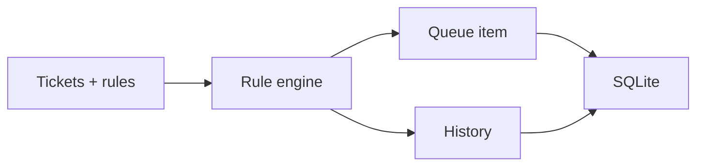

# Python Support Automation Simulator

Independent public portfolio project for **Python**, **automation workflows**, **SQLAlchemy** and **SQLite**.

This repository was created from scratch with fictional tickets and synthetic rules. It does not contain corporate code, real data, private endpoints, credentials, logs or proprietary rules.

## Problem

Support workflows need repeatable triage, queue assignment, state transitions and auditability without exposing real tickets.

## What It Demonstrates

- Fictional `Ticket`, `Rule`, `QueueItem`, `Action` and `History` entities.
- Rule-based queue routing.
- State-transition audit trail.
- SQLite persistence through SQLAlchemy.
- Focused tests for routing and persistence behavior.

## Architecture



See [docs/architecture.md](docs/architecture.md) for details.

## Stack

`Python` `SQLAlchemy` `SQLite` `JSON` `PyTest`

## Run Locally

```powershell
python -m pip install -e .
python examples/run_demo.py
```

## Run Tests

```powershell
python -m pip install -e ".[dev]"
pytest
```

## Technical Decisions

- SQLite is used because the simulator is intentionally local and lightweight.
- SQLAlchemy is used to show relational modeling and keep the workflow testable.
- PostgreSQL is not used in this repo because it would not add enough value for the current scope.

## Roadmap

- Add more transition rules after the PyTest study phase.
- Add report export by queue and action type.
- Keep the domain fictional and generic.

## Security and Independence

See [SECURITY.md](SECURITY.md) and [DISCLAIMER.md](DISCLAIMER.md).
