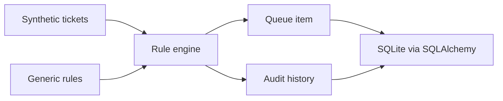

# Architecture

## Design Goal

Simulate a support automation workflow with fictional tickets, generic rules, queues and an audit trail.

## Flow

## Persistence Choice

SQLite is intentionally kept for this project because the workflow is local, small and interview-friendly. PostgreSQL would add operational weight without changing the main learning signal.
